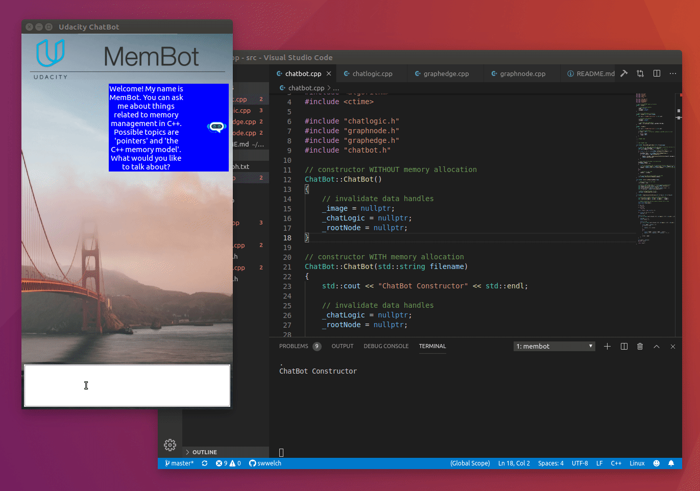

# Memory Management Chatbot



This is a chat bot program where users can ask questions about some aspects of memory management in C++ and the bot will answer based on a knowledge base file. The network contains of nodes connected to each other. Each node represents a questions and two possible answers. The knowledge base file can be easily modified to include more possible questions, answers and keywords.

This program is optimized from a memory management prespective using concepts such as:

```
- Smart Pointers
- Move Sematics
- The Rule of Five
- RAII(Resource Allocation Is Initialization).
```

I have completed this project as a part of my [Udacity C++ Nanodegree Program](https://www.udacity.com/course/c-plus-plus-nanodegree--nd213)

## Basic Build Instructions

1. Clone this repo.
2. Make a build directory in the top level directory: `mkdir build && cd build`
3. Compile: `cmake .. && make`
4. Run it: `./membot`.
